The core idea of this project is an AI Text Monitor.

To explain, this project leverages multiple state of the art, pretained neural networks 
via Hugging Face Transformers, an open source network for deep learning. This project presents
these models with a clean, sleek front-end LOCAL website using Flask (a python library designed to make easy web applications), HTML and Jinja2 (a web template engine for Python), hundreds of lines of Javascript code, SQL Databases, and Python itself.

The AI Text Monitor allows for the user to process an indivual piece of text and analyze 

1. Whether it's "toxic" or "non-toxic"
2. Whether it's negative, neutral, or positive
3. Whether its Passionate/Angry, Concerned/Fearful, Disgusted, Neutral, Joyful, Sad, or Surprised

On the other hand, the AI Text Monitor also allows the user to store a particular 
YouTube channel or Reddit Forum and then analyze X num of comments from that channel/forum.
The percentages of this analysis (e.g., 10% toxic, 90% non-toxic) are stored in a back-end database 
and can be viewed at will.

----------------------------------------------------------------------------------------------------------

**Rules/Things to Take Note Of**

1. The YouTube API/Reddit API is inconsistent, so, on occassion, the AI Text Monitor cannot analyze a certain channel/forum
2. Whenever a client disconnects from the server, further inference of YouTube/Reddit comments is cancelled server-wide and the current model results are stored (if the server abruptly ends, the results may or may not be saved, depending on quickly the program self-ends)
3. Don't use more than one client at any given time - this can slow down resources and create unexpected errors.  
4. If CTRL-C is used to end the program, all tabs of the project will be redirected a chosen website (this is not a guarantee, and can vary with different browsers/versions of browsers)
5. If app.py is terminated using the 'End Data Inference' button on the website, will be redirected a chosen website  (this is not a guarantee, and can vary with different browsers/versions of browsers)   
6. After adding/deleting/running inference on a YT Channel or Reddit Forum, you have to reload the page for the changes to be visible.

----------------------------------------------------------------------------------------------------------------------
**Pulling The Project From Github**

1. Navitage to the directory you want the AI_Text_Monitor/ to be in
2. Run 'git clone https://github.com/ChampPhil/AI-Text-Monitor.git' in your Jetson Nano terminal 

-----------------------------------------------------------------------------------------------

**Before Running The Project**

Setting Up YouTube API Key:

- Create a Google Account/Have a preexisting Google Account
- Go to the Google Developer Console For YouTube (https://developers.google.com/youtube), sign in to your google account, and create a project
- Click on the 'Enable APIs and Services' button and search for 'YouTube Data API v3'
:
  
  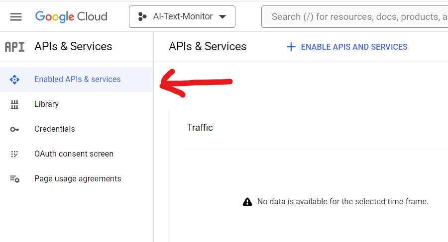

- Click on the result and press 'Enable'
- Return To your project page, and you should now see this:
    
    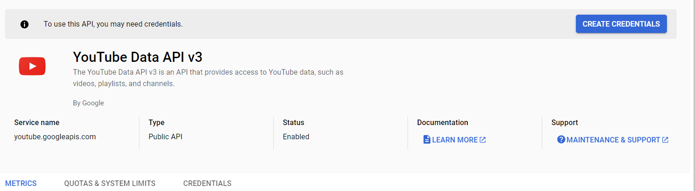

- Click on 'Create Credentials' 
- When asked "Which API are you using", select the "Public Data" on click on "Next"
- You should see this following screen:

    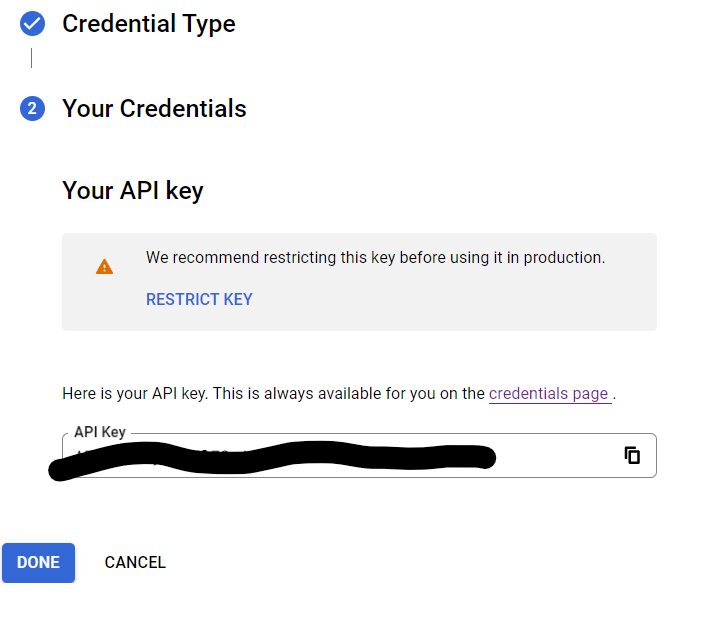
- Remember this API Key!

Setting Up Reddit API Key:

- Create a reddit account at https://www.reddit.com (remember the username and password)
- Go to the reddit app page (https://www.reddit.com/prefs/apps) and add an app
 
     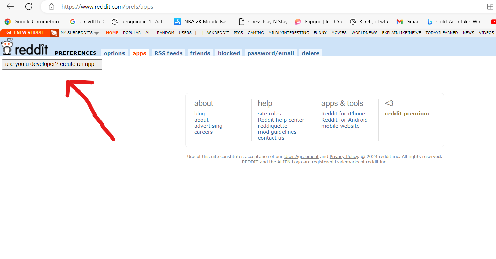

- Add a name (whatever you want)
- Select 'Script for personal use. Will only have access to the developers accounts'
- (Optional) - Add a description
- Add https://google.com (or https://bing.com) to the 'redirect url' input box and click on the 'Create' button
- Remember the client-id (the first crossed out thing in the following picture) and the secret token (the second crossed out thing in the following picture)
  
  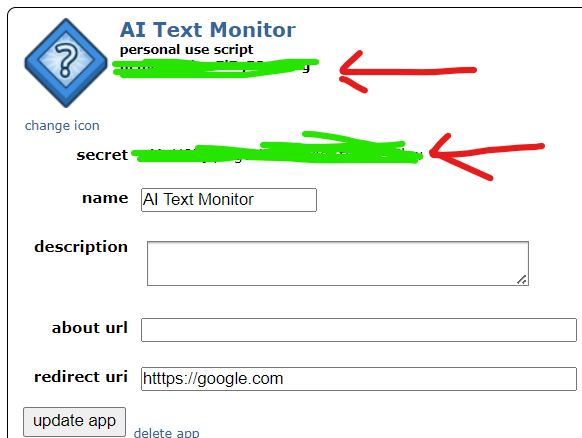

----------------------------------------------------------------------------------------------------------------------

**Installing Necessary Libraries**

<ins>Make sure you are in the same directory as requirements.txt </ins>

Run "pip install -r requirements.txt" or "pip3 install -r requirements.txt"

----------------------------------------------------------------------------------------------------------------------

**Inputting User Data Into The Project**

- Navigate to the "dev_tools" library
    - The project comes with the database.db and auth_database.db pre-installed, so ignore create_auth_database.py and create_main_database.py
- Open up edit_auth_database.py and go to line 12 where it has the comment "Edit these values"
- Fill in these values with the instructions present
    - The default_site variable dictates the "chosen site" where tabs of this project will redirect to when the server is shut down. 
    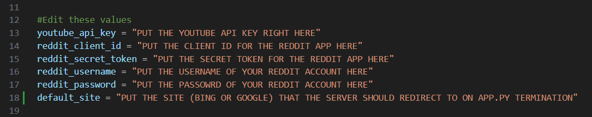
- After making these changes, run edit_auth_database.py
    - edit_auth_database.py will run a preliminary API request to make sure you inputted the proper values (and if not, the script will state where you went wrong.)

----------------------------------------------------------------------------------------------------------------------

**Prepping your Browser For The Project**
 
To allow the server to accurately redirect users upon termination, you must enable popups in your chosen browser. Use the following articles to enable pop-ups on this project for Google, Bing, or Firefox. 

-  https://www.howtogeek.com/732439/how-to-allow-pop-ups-in-microsoft-edge/
-  https://www.businessinsider.com/guides/tech/allow-pop-ups-chrome
-  https://www.businessinsider.com/guides/tech/how-to-allow-pop-ups-on-firefox

----------------------------------------------------------------------------------------------------------------------
 
 

***Enter python3 app.py into your CLI to actually start up the project***

 
 

**Detailed Breakdown of Each Aspect of Website**

  
*NavBar*
 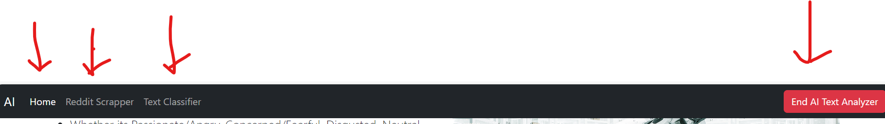

This Navbar allows you to switch between three pages:
- 'Home' - Where you can add YT Channels for further analysis
- 'Reddit Scrapper' - Where you can add Reddit Forums for further analysis
- 'Text Classifier' - Where you can process an indivual piece of text.

<ins>Note: 'End AI Text Analyzer' - Shuts down the server</ins>

 
 

*Home Page (How To Add Channels)*
 

  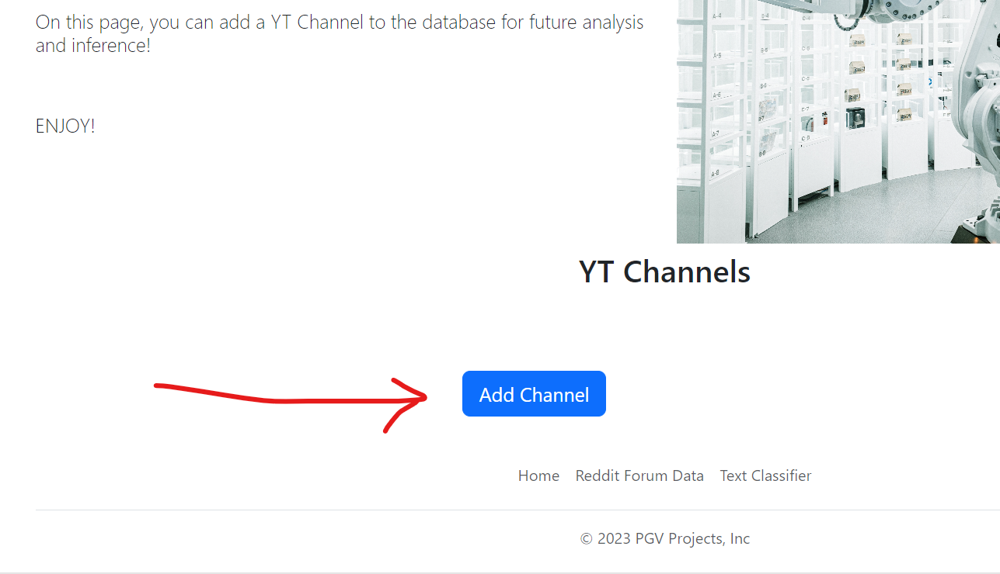

   Click on 'Add Channel' to open up a form where you can input the display name of said channel

   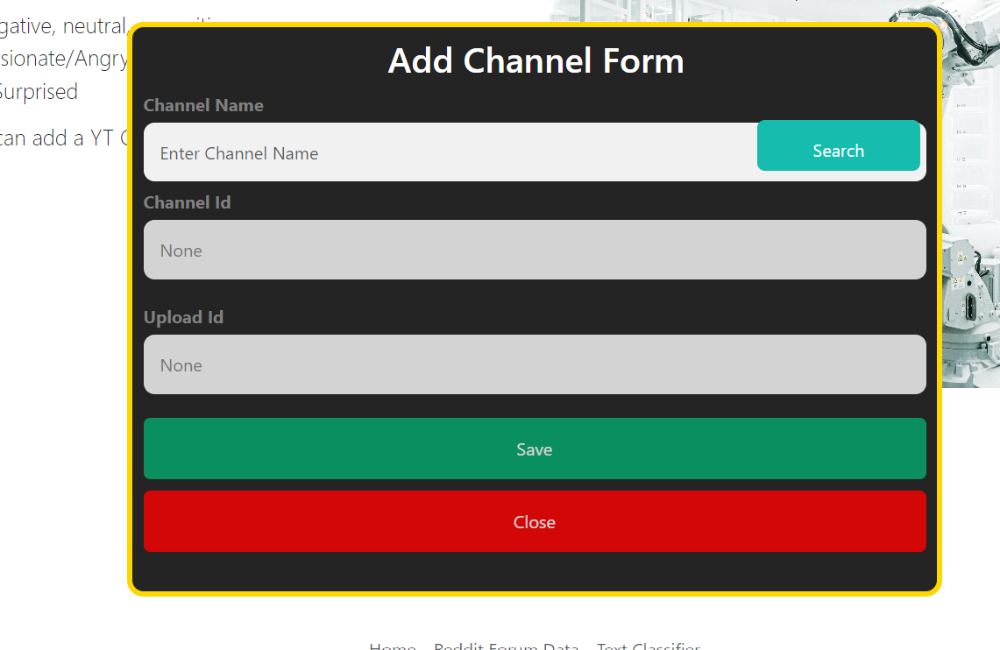

   Input the channel name into the 'Channel Name' input box and press' Search', which will run an API_Request to determine if the inputted channel display name exists
       
   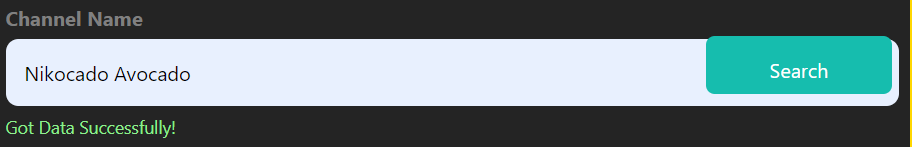

   -  If the Form says 'Channel Name is Invalid' - you may have mispelled the display name. 
   

   If you successfully 'Searched' the display name, press 'Save' to add your model to the database. Then, reload the page for your changes to take effect!

  
    
 
 

*Reddit Scrapper (How to Add Channels)*
   
- Scroll down to the bottom of the page and click 'Add Channel' to view the following form

   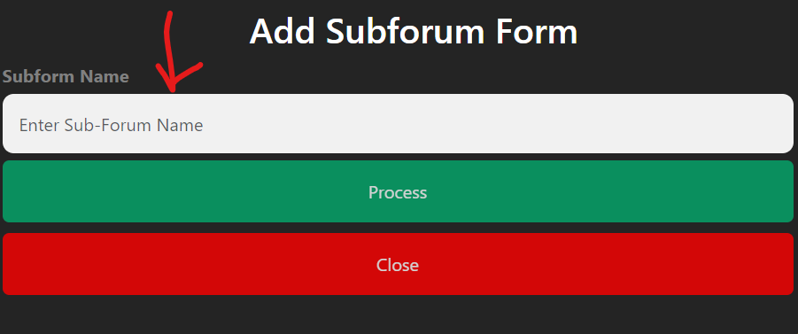

- Input a Reddit Forum name (with the r/) into the 'Subforum Name' input field

    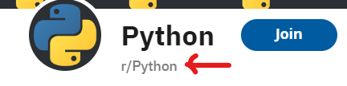

- Press 'Process'
   - If the forum name exists, it is now added to database (reload to see the change!)
   - If the forum name does not exist, you get the following:

    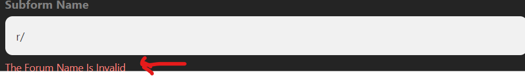

 
 

*View Data, Process Data, Delete Data (For 'Home' and 'Reddit Scrapper')*

<ins>Note: This applies to both 'Home' and 'Reddit Scrapper'</ins>

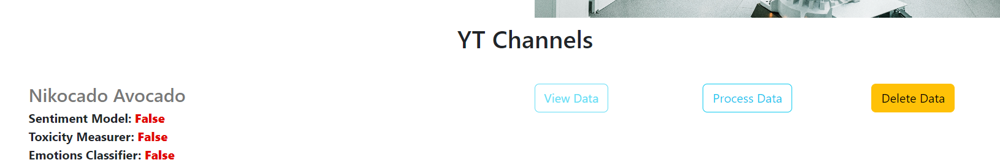

- 'Delete Data' will remove the YT Channel or Reddit Forum from the database
- 'Process Data' will allow you to run inference on your data source (Reddit Forum or YouTube Channel) 
- 'View Data' will allow you to view the results of the inference

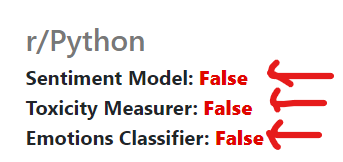

- These indicate if, for that data source, have you run Sentiment, Emotions, or Toxicity analysis
   - If you haven't run inference at all, the 'View Data' button will be disabled, as you can't view results that arent there. 

 
 

*Running Inference (Press on 'Process Data' to open this page*)

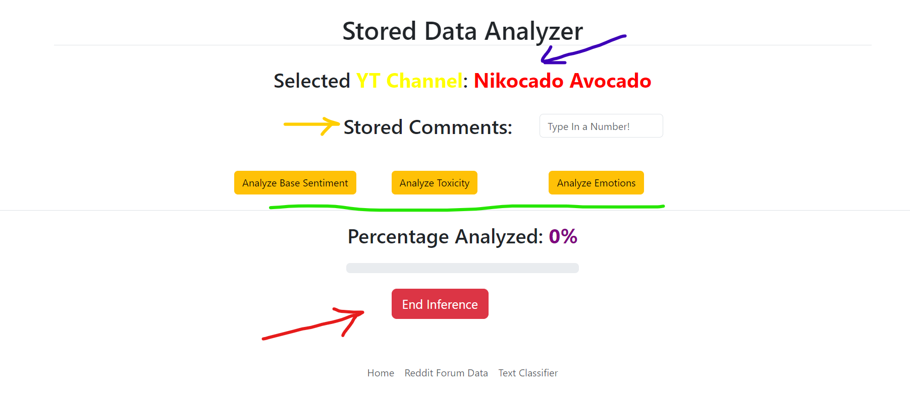

- Purple Arrow: The data source you are analyzing
- Green Arrow:  Which model do you want to run
- Red Arrow: End Inference
- Yellow Arrow: Amount of most recent comments you want to get from data source

<ins>Once you start inference, you will get a steady stream of live results in a bar graph and pie chart</ins>

 
 

*View Results of Completed Analysis*

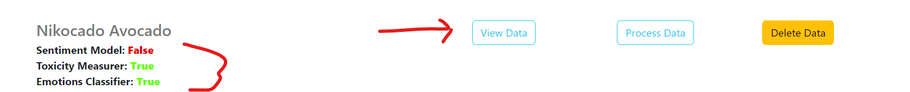

- If you have run inference with at least one model, you can view the results of that inference by clicking the 'View Data' button 

 
 

*Run Inference on a Single Piece of Text*

- Go to the "Text Classifier" subpage through the navbar or the footer. 

- You have three models to choose from

- Every model with have a UI that looks like this:

   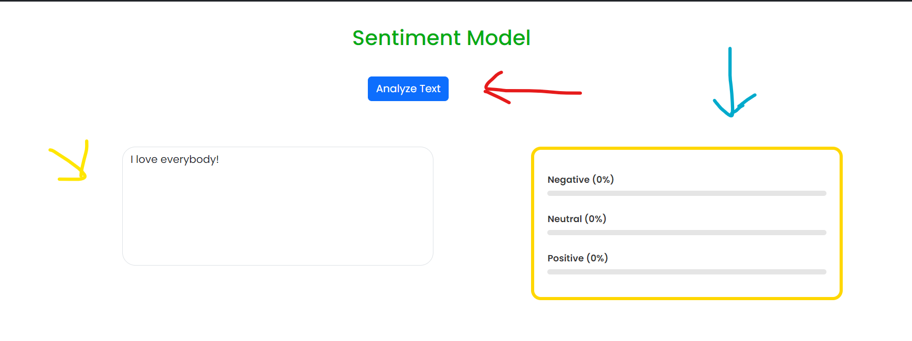 

   - Red Arrow: The name of the model
   - Yellow Arrow: The input (the text that you want analyzed)
   - Blue Arow: The output (the labels)

   <ins>Each model is a multi-class classification model, not a multi-label classification model. </ins>

   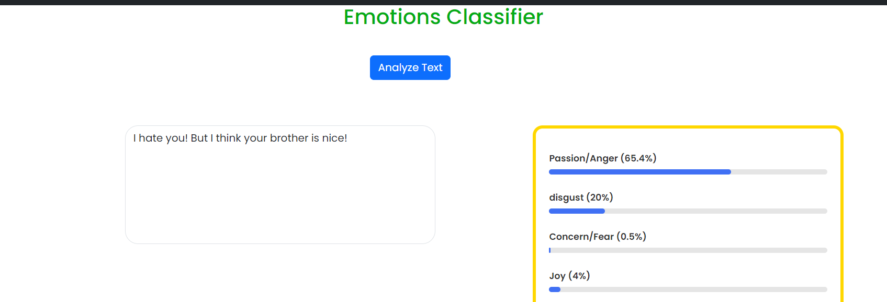 
      - In the above instance, the model is 65% sure the text is labeled Passsion, 20% sure the text is labeled labeled Disgust, etc.
      - It is NOT 65% Passionate, 20% Joy, etc (that's multi-label, not multi-class)